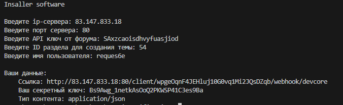

# Установка
Для установки, вам требуется перейти в директорию с проектом, написать в консоль `pip install -r requirements.txt`, после установки всех библиотек, запустите установщик `python3 installer.py`. Далее вы получите свои данные (сохраните их)

# Настройка тригера на гитхабе
Зайдите в свой репозиторий -> Settings -> Webhooks и нажимаете на `Add webhook`, введите полученные данные и сделайте тестовый commit.
